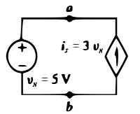
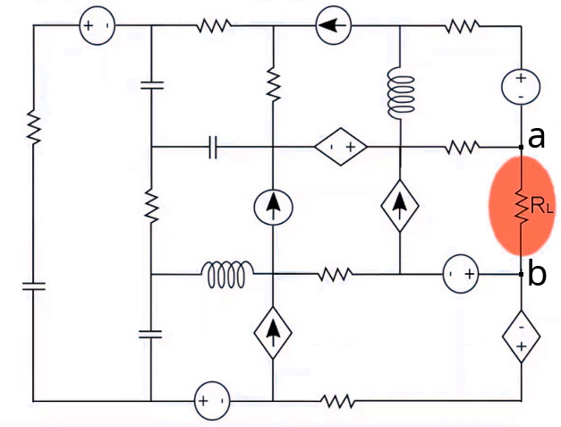
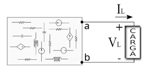
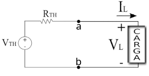
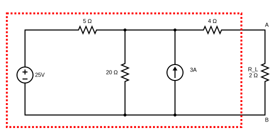
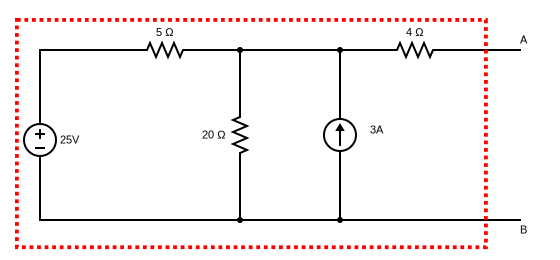

# Análise de Circuitos Elétricos
## Aula 04 - Teoremas de Thévernin e Norton
 
Prof. M.Sc. Diego Ascânio Santos (ascanio@cefetmg.br)

Aula baseada sobre o material da professora Drª. Jossana Maria de Souza Ferreira (jossana.ferreira@ufrn.br - ECT - ESCOLA DE CIÊNCIAS E TECNOLOGIA UFRN) e da professora Drª. Thabatta Moreira Alves de Araújo (thabatta@cefetmg.br - DIGDDV)

CEFET-MG DIGDDV - Divinópolis, 2023.

---

<!-- _class: lead -->
# Disclaimer

<!-- _class: lead -->
## Explicit is better than implicit.

Estes slides obedecem a este princípio.

---

## Roteiro

1. Fontes dependentes de corrente e de tensão;
2. Linearidade e sobreposição;
3. Homogeneidade, Sobreposição e a Produção de Circuitos Equivalentes;
4. Teorema de Thévenin;
5. Construção de circuitos equivalentes pelo teorema de Thévenin;
6. Teorema de Norton;
7. Construção de circuitos equivalentes pelo teorema de Norton;

---

## Fontes Dependentes

- Fontes de tensão e corrente são ditas independentes quando não são influenciadas por qualquer outra corrente ou tensão no circuito. 
    - Sua representação gráfica consiste em um circulo com os pólos positivo e negativo (quando se trata de uma fonte de tensão) ou um circulo com uma seta (quando se trata de uma fonte de corrente).

- Quando os valores de uma fonte de tensão ou corrente são determinados por outra tensão ou corrente do circuito, então dizemos que estas fontes são dependentes.
    - Na imagem da fonte dependente de tensão (corrente), verificamos que sua tensão \\(V_{s} = 3 V_{x}\\) (corrente \\(i_{s} = 3 V_{x}\\)) é dependente da tensão \\(V_{x} = 5V\\) presente entre os pontos \\(a\\) e \\(b\\) do circuito, onde \\(V_{x}\\) também corresponde à tensão da fonte de tensão independente do circuito.

- A representação gráfica das fontes dependentes consistem em um losango contendo pólos \\(-\\) quando a fonte dependente fornece tensão \\(-\\) ou um losango contendo uma seta \\(-\\) quando a fonte dependente fornece corrente.

<figure>

<!-- _class: transparent -->

<figcaption>Circuito com fonte dependente de Tensão</figcaption>

</figure>

<figure>

<figcaption>Circuito com fonte dependente de Corrente</figcaption>

</figure>

---

## Linearidade e Superposição

- Toda função matemática é linear quando ela é FECHADA na adição (propriedade da aditividade - superposição) e na multiplicação por escalar (propriedade da homogeneidade - linearidade).
    - FECHADA implica dizer que ao adicionar funções lineares ou multiplicar uma função linear por um valor escalar produzo outra função linear resultante (Conceitos oriundos da álgebra linear, não serão desenvolvidos a fundo por fugirem do escopo da disciplina).

- A função da Lei de Ohm, representada por \\(V(t) = Ri(t)\\) é uma função linear (toda função linear é da forma \\(y = ax + b)\\).
- Assim, pelos princípios da superposição e linearidade, circuitos elétricos resistivos (capacitivos e indutivos em situações específicas) são equivalentes a sistemas de equações lineares.
    - Por isso, conseguimos resolver circuitos usando sistemas lineares.

---

## Homogeneidade, Sobreposição e a Produção de Circuitos Equivalentes

- A homogeneidade nos ajuda a atribuir arbitrariamente valores para elementos dos circuitos e, consequentemente, deduzir demais grandezas, por garantir que as multiplicações por valores escalares persistem a produzir elementos lineares.

- A sobreposição de circuitos nos permite deduzir que a as grandezas de um elemento podem ser calculadas levando-se em consideração a contribuição individual de elementos de circuito sobre eles, pois, a propriedade da adição garante que a adição de funções lineares continua a produzir outra função linear.

- Diante disso tudo, estes princípios nos permitem deduzir (e verificar) a existência de circuitos equivalentes, pois, ao garantirem que a sobreposição e homogeneidade produzem funções lineares, logo, formas distintas de se produzirem o mesmo circuito se equivalem.
    - Estas considerações representam tão somente embasamentos teóricos para garantir a validade das operações a serem vistas nos próximos slides. Sua discussão na disciplina se encerra neste slide e estas considerações não são objetos de avaliação do conhecimento da disciplina, pois, reiterando, estão aqui apenas para servir de alicerce \\(-\\) demonstrar a base que permite a existência de circuitos equivalentes, bem como, dos teoremas de Thévenin e Norton, abordados na sequência.

---

<!-- _class: lead -->
# Teorema de Thévenin

---

## Teorema de Thévenin

- O Teorema de Thévenin é um teorema para a simplificação de circuitos que estabelece que:
    - Quaisquer elementos lineares de circuitos entre dois terminais \\(a\\) e \\(b\\) podem ser substituídos por um circuito elétrico equivalente composto por uma fonte de tensão de Thévenin \\((V_{\text{TH}})\\) em série a uma resistência de Thévenin \\((R_{\text{TH}})\\).
    - Porque isto é útil? Porquê nos permite simplificar grandes circuitos complexos em um simples circuito de fonte de tensão e resistência em série que permite facilitar a análise de elementos específicos em um circuito, principalmente, no caso em que desejamos modificar um elemento específico de um circuito (uma resistência \\(R_{L}\\) por exemplo) várias vezes em sequência.
    - Ao mudar os valores de \\(R_{L}\\) várias vezes, sem qualquer tipo de técnica de simplificação do circuito, é necessário reescrever todo o sistema de equações que representa o circuito, pois, uma mudança em um elemento implica uma mudança em uma ou mais equações do sistema.
- Reiterando, o Teorema de Thévenin consiste em substituir uma parte do circuito cujos detalhes não interessam por um circuito equivalente formado por uma fonte de tensão \\((V_{\text{TH}})\\) em série a uma resistência de Thévenin \\((R_{\text{TH}})\\).

<figure>

<!-- _class: transparent -->

<figcaption>Exemplo de circuito que pode ser simplificado</figcaption>
</figure>

<figure>

<!-- _class: transparent -->

<figcaption>

Simplificação proposta para os componentes do circuito entre os terminais \\(a\\) e \\(b\\) por meio de circuito equivalente de Thévenin

</figcaption>
</figure>

---

## Teorema de Thévenin - Como Aplicar?

Reiterando: a aplicação do Teorema de Thévenin consiste na substituição de um circuito de maior complexidade com múltiplos elementos presente entre dois terminais \\(a\\) e \\(b\\) por um circuito simples que consiste em uma fonte de tensão de Thévenin em série a uma resistência de Thévenin:

<figure>

<!-- _class: transparent -->

<figcaption>

Circuito de maior complexidade entre terminais \\(a\\) e \\(b\\)

</figcaption>

</figure>

<figure>

<!-- _class: transparent -->

<figcaption>

Circuito simplificado equivalente Thévenin entre terminais \\(a\\) e \\(b\\)

</figcaption>

</figure>

Destarte, nosso objetivo passa a ser encontrar os valores da resistência de Thévenin e da tensão de Thévenin. Como encontrá-los?

---

<!-- _class: lead -->
# Construção de Circuitos Equivalentes Pelo Teorema de Thevenin

---

## Construção de Circuitos Equivalentes Pelo Teorema de Thévenin - Algoritmo

1. Definir qual ponto do circuito a ser simplificado, sinalizado pelos terminais \\(a\\) e \\(b\\).
2. Remover (temporariamente) o resistor \\(R_{L}\\) do circuito.
3. Encontrar a resistência de Thévenin \\(R_{\text{TH}}\\): Zerar apenas as fontes independentes \\(-\\) curto-circuitar as fontes de tensão e abrir as fontes de corrente \\(-\\) e calcular a resistência equivalente deste circuito sem as fontes independentes.
4. Encontrar a tensão de Thévenin \\(V_{\text{TH}}\\) nos terminais \\(a\\) e \\(b\\), considerando a atuação de todas as fontes independentes do circuito. O método estudado da construção de sistemas de equações lineares à partir das LKC, LKT e Lei de Ohm é suficiente.
5. Construir o circuito equivalente de Thévenin adicionando o elemento de carga (aqui representado por \\(R_{L}\\)) de volta ao circuito.

---

## Equivalente de Thevenin - Exemplo Sem Fontes Dependentes

Substitua os elementos à esquerda dos terminais \\(A\\) e \\(B\\) (que abrangem o resistor \\(R_{L}\\)) por sua fonte e resistência de Thévenin equivalentes.

<!-- _class: transparent -->

---

## Equivalente de Thévenin - Exemplo Sem Fontes Dependentes

### Passo 1

Definir qual ponto do circuito a ser simplificado, sinalizado pelos terminais \\(A\\) e \\(B\\).

Definimos que o subcircuito contido na área pontilhada em vermelho, a esquerda dos terminais \\(A\\) e \\(B\\), será o simplificado:

<!-- _class: transparent -->

---

## Equivalente de Thévenin - Exemplo Sem Fontes Dependentes

### Passo 2

Removemos temporariamente o resistor \\(R_{L}\\) do circuito.

<!-- _class: transparent -->

---

## Equivalente de Thévenin - Exemplo Sem Fontes Dependentes

### Passo 3 - Encontrar a Resistência de Thévenin \\(R_{\text{TH}}\\) equivalente.

1. Zeramos somente as fontes independentes
    1. Curto Circuitamos as Fontes de Tensão Independentes
    2. Removemos as Fontes de Corrente Independentes
    3. Calculamos a Resistência Equivalente desta configuração.

\\[
\begin{align}
R_{\text{TH}} &= 4 \Omega + 5 \Omega || 20 \Omega \\\\
R_{\text{TH}} &= 8 \Omega
\end{align}
\\]

<!-- _class: transparent -->

---

## Equivalente de Thévenin - Exemplo Sem Fontes Dependentes

### Passo 4 - Encontrar a Tensão de Thévenin \\(V_{\text{TH}}\\) nos Terminais \\(A\\) e \\(B\\).

1. Retornamos as fontes de tensão independentes para o circuito.
2. Calculamos pelas leis de Kirchoff da corrente e da tensão, bem como, pela lei de Ohm, as tensões e correntes que passam pelos elementos do circuito.
3. Encontramos \\(V_{\text{TH}}\\).

<figure>

<!-- _class: transparent -->

<figcaption>

Passo \\(4.1\\) - Retorno das fontes independentes ao Circuito

</figcaption>

</figure>

---

## Equivalente de Thévenin - Exemplo Sem Fontes Dependentes

### Passo 4.2

<figure>

<!-- _class: transparent -->

<figcaption>

Circuito com o retorno das fontes.

</figcaption>

</figure>

Ao retornar as fontes independentes ao circuito verificamos que não flui corrente no resistor de \\(4 \Omega\\), pois, o terminal \\(A\\) está desconectado. Desta forma, a corrente no resistor de \\(4 \Omega\\) é zero e por isso, o resistor pode ser desconsiderado do circuito para o cálculo da tensão de Thévenin.

**Mas, ainda assim, existe tensão entre os terminais \\(A\\) e \\(B\\)**

Portanto, o circuito pode ser representado como:

<figure>

<!-- _class: transparent -->

<figcaption>

Passo \\(4.2\\) - Resistor de \\(4 \Omega\\) desconsiderado do Circuito

</figcaption>

</figure>

---

## Equivalente de Thévenin - Exemplo Sem Fontes Dependentes

### Passo 4.2

Pelas Lei de Ohm, de Kirchoff da Corrente nos Nós e de Kirchoff das Tensões nas Malhas temos:

\\[
\begin{align}
V_{i} - 5 i_{1} &= 0 \\\\
V_{j} - 20 i_{2} &= 0 \\\\
i_{1} - i_{2} &= -3
\end{align}
\\]

\\[
\begin{align}
V_{k} - 20 i_{2} &= 0 \\\\
5 i_{1} + 20 i_{2} &= 25
\end{align}
\\]

Que produz o seguinte sistema linear na forma matricial:

\\[
\begin{bmatrix}
1 & 0 & 0 & -5 & 0 \\\\
0 & 1 & 0 & 0 & -20 \\\\
0 & 0 & 0 & 1 & -1 \\\\
0 & 0 & 1 & 0 & -20 \\\\
0 & 0 & 0 & 5 & 20
\end{bmatrix}
\begin{bmatrix}
V_{i} \\\\
V_{j} \\\\
V_{k} \\\\
i_{1} \\\\
i_{2}
\end{bmatrix}
{ = }
\begin{bmatrix}
0 \\\\
0 \\\\
-3 \\\\
0 \\\\
25
\end{bmatrix}
\\]

Este sistema linear em sua representação matricial é resolvido no próximo slide.

<figure>

<!-- _class: transparent -->

<figcaption>

Correntes, tensões, sentidos de quedas de potencial, malhas e nós indetificados no circuito.

</figcaption>

</figure>

---

## Resolução do Circuito No JupyterLite pelo SymPy

<iframe src="https://diegoascanio.github.io/jupyterlite/lab?path=thevenin-sem-fontes-dependentes.ipynb" width=100% height=100%></iframe>

---

## Equivalente de Thévenin - Exemplo Sem Fontes Dependentes

Ao resolver o sistema linear que representa o circuito descobrimos que \\(V_{K} = V_{\text{TH}} = 32 V\\) e assim, finalizamos o passo 4. Com o valor de \\(R_{\text{TH}} = 8 \Omega\\) obtido no passo 3, conseguimos então construir o equivalente de Thévenin (Passo 5) representado a direita, com a volta do elemento \\(R_{L} = 2 \Omega\\) ao circuito.

<!-- _class: transparent -->

---

## Equivalente de Thévenin - Exemplo com Fontes Dependentes

Quando existem fontes dependentes de tensão ou de corrente no circuito, aplicamos o mesmo algoritmo para fontes independentes, exceto pelo fato de que não removemos as fontes dependentes do circuito. A existência de elementos dependentes no circuito implica que ao menos uma variável será linearmente dependente de outra, o que pode impedir a resolução do sistema no estado que desejamos: um sistema possível e determinado.

Por isso, nestes casos, convém adicionar ao menos uma fonte de tensão virtual \\(V_{0}\\) percorrida por uma corrente virtual \\(I_{0}\\) entre os terminais \\(A\\) e \\(B\\) onde se deseja encontrar a resistência e a tensão equivalentes de Thévenin. Porquê? Porquê ao admitirmos que se existe uma fonte de tensão \\(V_{0}\\) com uma corrente virtual \\(i_{0}\\) entre os polos \\(A\\) e \\(B\\) onde desejamos construir o equivalente de Thévenin, logo, podemos encontrar a resistência de Thévenin pela lei de Ohm, onde: \\(R_{\text{TX}} = {{V_{0}} \over {I_{0}}}\\) e por consequência, adicionar mais um termo linearmente independente às equações do sistema para conseguirmos calcular os valores exatos, tornando o sistema possível e determinado!

É muito verboso, é muito textual e é necessário algum conhecimento em álgebra linear para o entendimento do raciocínio exposto acima. Entretanto, tudo isso pode ser esquematizado em um simples algoritmo exposto nos próximos slides.

